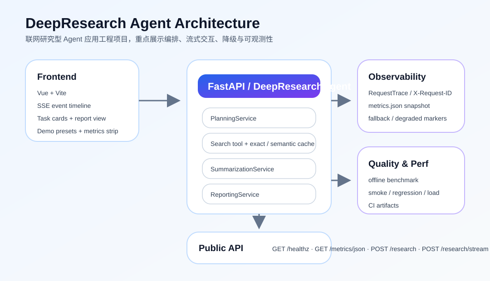
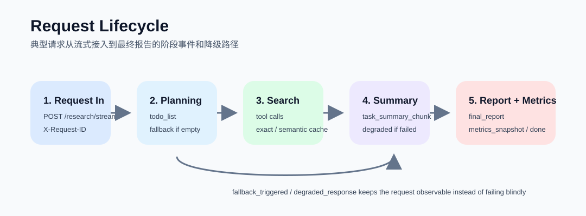

# DeepResearch Agent

联网研究型 Agent 应用工程项目，强调 `任务规划 + 工具调用 + 流式交互 + 失败降级 + 可观测性 + benchmark / CI` 的完整闭环。

这个仓库的定位不是知识库 RAG，也不承担向量检索主线；它更适合在简历里展示 Agent 产品化和工程落地能力。金融研报项目负责讲 RAG，这个项目负责讲开放互联网研究 Agent。

## 项目亮点

- 后端：FastAPI + HelloAgents，串联 `planning -> research -> review -> report`，并在任务级和报告级引入受控 ReAct 闭环
- 前端：Vue + Vite，消费 `/research/stream` SSE 事件，展示任务卡片、流程记录、工具调用痕迹和最终报告
- 工程闭环：request trace、`X-Request-ID`、exact / semantic cache、fallback / degraded、offline benchmark、perf smoke / regression / load、CI
- 演示保底：支持 `BENCHMARK_STUB_ENABLED=True`，在网络或模型不稳定时依然可以稳定演示完整 Agent 流程

## 5 分钟跑通

### 1. 启动后端

```bash
cd backend
cp .env.example .env
/media/main/hjz/agent/deepresearch/helloagents-deepresearch/backend/.venv/bin/python src/main.py
```

默认监听 `http://localhost:8000`。

### 2. 启动前端

```bash
cd frontend
npm ci
npm run dev
```

前端默认开发端口是 `5174`，会调用 `http://localhost:8000`。

### 3. 打开固定演示场景

首页已经内置 3 个固定 demo 题目，优先使用：

- `探索多模态大模型在 2025 年的关键突破`
- `AI 搜索 Agent 在互联网信息研究中的工程化实践`
- `开源大模型推理服务的部署、监控与成本控制`

## 架构图



## 典型请求生命周期



## API

- `GET /healthz`
- `GET /metrics/json`
- `POST /research`
- `POST /research/stream`

## Agent 工程能力

### 状态机与事件

- Planner 先生成结构化任务清单，前端按任务卡片和时间线实时展示
- SSE 会逐步推送 `status`、`todo_list`、`task_status`、`task_iteration_started`、`task_gap_detected`、`repair_cycle_started`、`tool_call`、`stage_started`、`stage_completed`、`metrics_snapshot`、`final_report`
- 任务状态包含 `pending / in_progress / completed / skipped`

### fallback / degraded

- planner 没有产出任务时，自动退化为单个兜底任务继续执行
- 任务数超过预算时，会自动截断为前 `MAX_AGENT_TASKS` 个任务继续执行，避免演示时链路过长
- 首轮任务存在明显缺口时，会在报告前插入一次轻量 `reflection / replan`，按预算补充 1~2 个任务
- 单任务执行支持 `TASK_REACT_ENABLED=True` 的受控 ReAct 小循环：先观察证据缺口，再决定是否改写 query、补多样化来源或抓取网页正文
- 报告生成前支持一次 `report repair loop`：仅针对高优先级 review issue 补 0~2 个 targeted tasks，再重新 review 后输出报告
- 搜索工具调用会受 `SEARCH_TOOL_TIMEOUT_SECONDS` 保护，避免单次外部调用无限阻塞
- 搜索工具失败或超时后，会按 `SEARCH_TOOL_RETRY_ATTEMPTS` 和 `SEARCH_TOOL_RETRY_BACKOFF_SECONDS` 执行可配置重试
- 单个任务搜索失败或总结失败时，不会直接让整条请求 500，而是保留已有结果并打上降级标记
- 请求级状态会根据任务结果和降级原因落到 `success / partial_success / failed`

### 可观测性

- 每次请求都有 `X-Request-ID`
- `/metrics/json` 提供 counters、latencies、recent request trace、estimated cost
- ReAct 相关观测包含 `task_react_round_total`、`task_react_continue_total`、`task_react_stop_total`、`task_react_stop_reason_counts`、`report_repair_trigger_total`
- 搜索缓存区分 exact hit、semantic hit、miss，便于解释命中策略
- 泛化任务检索词会自动重写为 `topic + title + intent` 风格，减少 planner 生成短 query 时的空检索

## 固定 demo 题目

| 场景 | 题目 | 建议讲解重点 |
| --- | --- | --- |
| 开放信息研究 | `探索多模态大模型在 2025 年的关键突破` | planner 拆任务、结构化总结、最终报告 |
| Agent 工程实践 | `AI 搜索 Agent 在互联网信息研究中的工程化实践` | tool call、阶段事件、metrics、SSE 体验 |
| 推理服务工程 | `开源大模型推理服务的部署、监控与成本控制` | 多任务研究、来源引用、性能与成本叙事 |

更详细的现场演示脚本见 [docs/DEMO_PLAYBOOK.md](docs/DEMO_PLAYBOOK.md)。

## 已验证的证据

以下结果为本地实际跑过的结果，日期为 `2026-03-25`：

| 项目 | 结果 |
| --- | --- |
| 后端单测 | `51 passed` |
| 前端构建 | `npm run build` 通过 |
| Perf smoke | `stub benchmark` 下 `p95 49.04ms`、`20.60 RPS` |
| Perf baseline | `perf.run_smoke --profile stub` baseline comparison `passed` |
| CI | backend lint / test / build + perf smoke / load + frontend build |

说明：perf 证据中的延迟和 RPS 来自 `stub benchmark`，用于稳定展示工程链路，不代表真实线上模型吞吐。

## 环境变量入口

实际配置入口是 `backend/.env`；[backend/.env.example](backend/.env.example) 只作为模板和字段参考。常用字段如下：

| 分类 | 变量 |
| --- | --- |
| LLM | `LLM_PROVIDER`, `LLM_MODEL_ID`, `LLM_API_KEY`, `LLM_BASE_URL`, `LOCAL_LLM`, `LMSTUDIO_BASE_URL`, `OLLAMA_BASE_URL` |
| Agent Runtime | `MAX_WEB_RESEARCH_LOOPS`, `MAX_AGENT_TASKS`, `REQUEST_REFLECTION_ENABLED`, `REFLECTION_MAX_ADDITIONAL_TASKS`, `TASK_QUERY_REWRITE_ENABLED`, `TASK_REACT_ENABLED`, `TASK_REACT_MAX_ROUNDS`, `TASK_REACT_MAX_FETCHES_PER_TASK`, `TASK_REACT_MAX_ADDITIONAL_SEARCHES_PER_TASK`, `REPORT_REPAIR_ENABLED`, `REPORT_REPAIR_MAX_TASKS`, `REPORT_REPAIR_MAX_CYCLES`, `ENABLE_NOTES`, `NOTES_WORKSPACE` |
| Tool Guardrails | `SEARCH_TOOL_TIMEOUT_SECONDS`, `SEARCH_TOOL_RETRY_ATTEMPTS`, `SEARCH_TOOL_RETRY_BACKOFF_SECONDS` |
| Search | `SEARCH_API`, `FETCH_FULL_PAGE`, `SEARCH_CACHE_ENABLED`, `SEARCH_CACHE_TTL_SECONDS`, `SEMANTIC_SCHOLAR_API_KEY` |
| Cache | `SEMANTIC_CACHE_ENABLED`, `SEMANTIC_CACHE_SIMILARITY_THRESHOLD`, `SEMANTIC_CACHE_LEXICAL_THRESHOLD` |
| Perf | `BENCHMARK_STUB_ENABLED`, `BENCHMARK_PROFILE`, `PERF_SAMPLE_INTERVAL_SECONDS` |
| Metrics | `METRICS_RECENT_REQUESTS_LIMIT`, `LLM_PRICING_JSON` |

当 `SEARCH_API=semanticscholar` 时，后端会通过 Semantic Scholar Academic Graph API 检索论文元数据与摘要。`SEMANTIC_SCHOLAR_API_KEY` 是可选项，但为了降低共享限流触发 `429` 的概率，建议在真实使用时配置。

## Benchmark / Perf / CI

### Offline benchmark

`backend/evals/` 提供 benchmark loader、heuristic judge 和批量运行脚本：

```bash
cd backend
/media/main/hjz/agent/deepresearch/helloagents-deepresearch/backend/.venv/bin/python evals/run_benchmark.py --input evals/benchmarks/sample_benchmark.jsonl --output evals/results/sample_results.json
```

### Engineering perf

```bash
cd backend
/media/main/hjz/agent/deepresearch/helloagents-deepresearch/backend/.venv/bin/python -m perf.run_smoke --profile stub
/media/main/hjz/agent/deepresearch/helloagents-deepresearch/backend/.venv/bin/python -m perf.run_regression --profile real_local --write-baseline
/media/main/hjz/agent/deepresearch/helloagents-deepresearch/backend/.venv/bin/python -m perf.run_load --profile stub --users 4 --spawn-rate 2 --duration 20s
/media/main/hjz/agent/deepresearch/helloagents-deepresearch/backend/.venv/bin/python -m perf.run_profile --profile real_local
```

### CI

CI 位于 `.github/workflows/ci.yml`，覆盖：

- backend lint
- backend test
- backend build check
- perf smoke / load
- frontend build

另外还有 `.github/workflows/perf-regression.yml`，用于手动或定时运行 regression / load / profile。

## 项目边界

- 这个项目不扩展知识库、向量库、chunk pipeline 或 rerank 主链路
- 它的价值在于 Agent 编排、SSE 交互、降级策略、可观测性和工程化闭环
- 金融研报项目负责承载 RAG 检索系统叙事，这个项目负责承载 Agent 应用工程叙事

## 更多文档

- [backend/README.md](backend/README.md)
- [docs/DEMO_PLAYBOOK.md](docs/DEMO_PLAYBOOK.md)
- [docs/INTERVIEW_GUIDE.md](docs/INTERVIEW_GUIDE.md)
- [ENGINEERING.md](ENGINEERING.md)
- [CODEBASE_DIFF_ANALYSIS.md](CODEBASE_DIFF_ANALYSIS.md)
